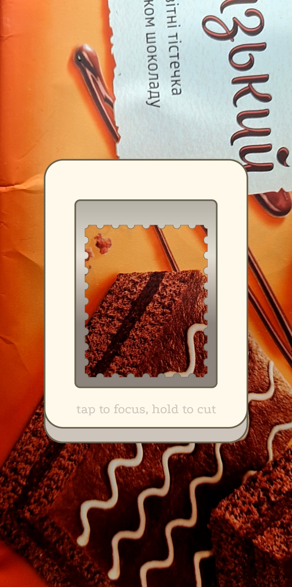
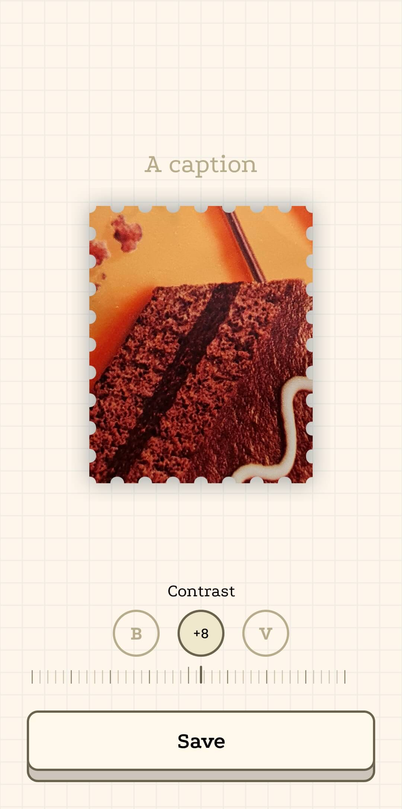
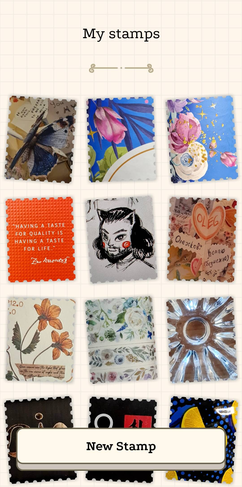
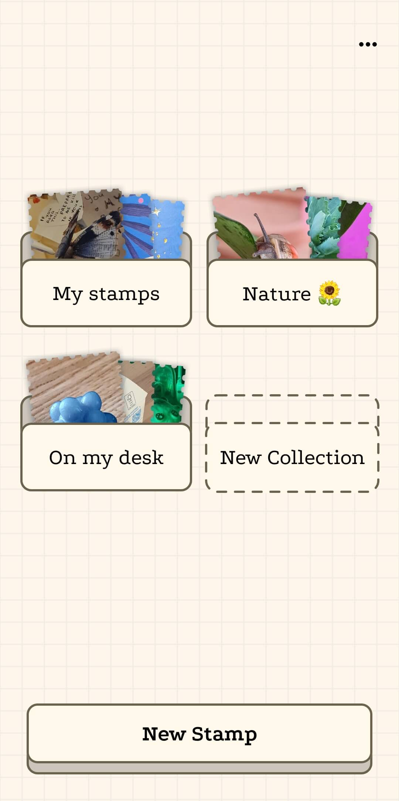
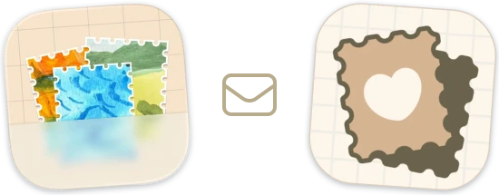

#  Press-Cut – a stamp cutter

With this Android app you can cut digital postage stamps from what your camera sees. For free and without limits.

<p>




</p>

The stamps are stored as images in your phone's "Pictures" folder.
They remain there even if you uninstall the app.

If you ever need to back up your collection or transfer it to a new phone, just copy the "PressCutStamps" contents from the "Pictures" folder.



Have friends using iPhone? Exchange stamps with them! Press-Cut envelopes can be opened in [OneStamp on iOS](https://apps.apple.com/us/app/onestamp/id6760986254) and vice versa.

## Download


[ APK from the latest release](https://github.com/Radiokot/press-cut-app/releases/latest)


[ Google Play](https://play.google.com/store/apps/details?id=ua.com.radiokot.camerapp)

## Technical details

The core concept of the app is that the stamp storage is the external file system. Stamps are stored as WebPs in the public "Pictures" folder. Stamp metadata (title, cut date) is stored in the XMP chunk, and can be seen in other software, for example, in Windows explorer. Collections are just folders, and the metadata (title) is stored in a single `.collection.webp` file's XMP chunk. The metadata file being an image is sketchy, but it's due to the modern Android restrictions. For details, see `FsStampRepository` and `FsStampCollectionRepository`.

On old Androids, the app uses external storage permission. On modern Androids, it uses read images permission combined with SAF directory access. Since SAF is slow, it is only used to reclaim ownership of files either left from previous app installation or copied to the stamp folder manually by the user (see `SafFileLocksmith`).

### Setup

```bash
git submodule update --init --recursive
```

### The stack

- Kotlin
- Compose UI without Material
- Flow & coroutines for concurrency
- Koin for dependency injection
- CameraX for camera preview and capture
- Landscapist for image loading
- Ashampoo Kim for WebP metadata manipulations
- kotlin-logging & logback-android for logging

## License
I reject the concept of intellectual property. Claiming ownership over information that can be replicated perfectly and endlessly is inherently flawed. Consequently, any efforts to uphold such form of ownership inevitably result in some people gaining unjustifiable control over other's tangible resources, such as computers, printing equipment, construction materials, etc. <sup>[1](repository-assets/kinsella_against_intellectual_property.pdf)</sup>
When talking specifically about source code licensing – without a state violently enforcing [copyright monopolies](https://torrentfreak.com/language-matters-framing-the-copyright-monopoly-so-we-can-keep-our-liberties-130714/), it would be ludicrous to assume that a mere text file in a directory enables someone to restrict processing copies of this information by others on their very own computers. 
However, there is [such a file](COPYING.txt) in this repository bearing the GPLv3 license. Why?

One would expect someone with such an attitude to not use the license at all, use a permissive license, or [explicitly unlicense](https://unlicense.org/).
But for me, to do so is to voluntarily limit my means of defense. To act as a gentleman with those who readily exploit state violence against you is to lose.
In a world where copyright monopolies are violently enforced, I choose GPLv3 for the software I really care for, because under the current circumstances this license is a tool that:
- Allows **others** to freely use, modify and distribute this software, without the risk of being sued;
- Enables **me** to pull all the valuable changes from public forks back to the trunk, also without the risk of being sued;
- **Knocks down a peg** individuals or companies willing to monopolize their use case or modifications of this software.

---

Press-Cut is inspired by [OneStamp for iOS](https://apps.apple.com/us/app/onestamp/id6760986254), made by Weiqing Chu. The app uses many [open-source libraries](app/src/main/assets/open_source_licenses.html) and [icons from Noun Project](app/src/main/assets/icons.html).
